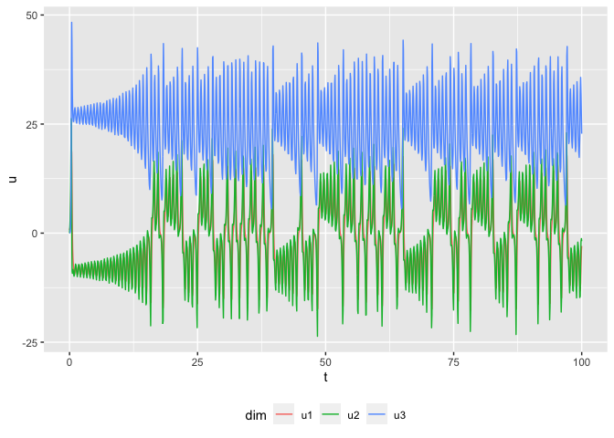
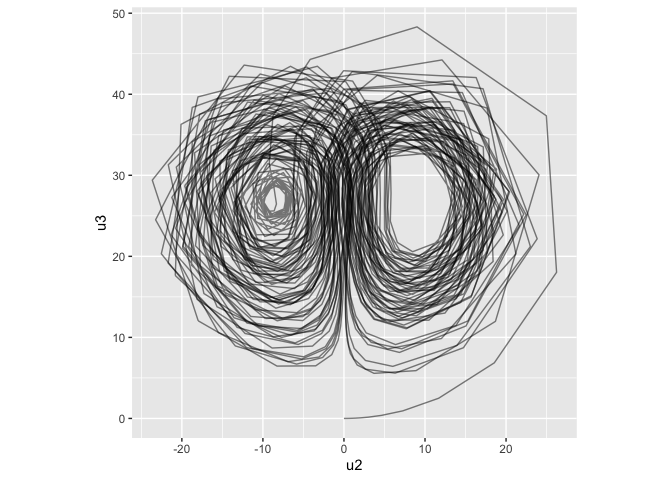
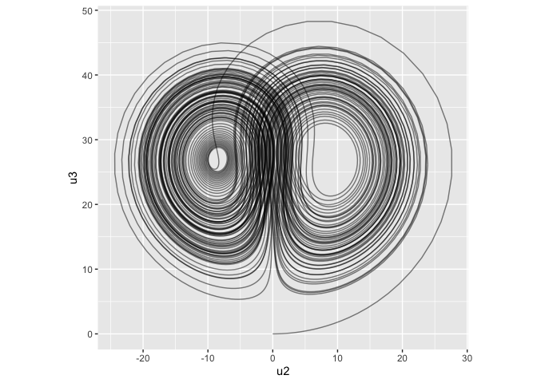

Solving ODEs with the diffeqr package
================
Bill Behrman
2020-04-10

  - [Simple ODE](#simple-ode)
  - [System of ODEs](#system-of-odes)
  - [Tolerances and time points](#tolerances-and-time-points)
  - [Alternate solvers](#alternate-solvers)
  - [Compiled derivative function](#compiled-derivative-function)

``` r
# Libraries
library(tidyverse)
library(diffeqr)

#===============================================================================

diffeq_setup() %>% 
  invisible()
```

The following is a reimplementation of code on the [diffeqr GitHub
site](https://github.com/SciML/diffeqr).

## Simple ODE

``` r
f <- function(u, p, t) {
  1.01 * u
}

u0 <- 0.5
tspan <- c(0, 1)

sol <- 
  ode.solve(f = f, u0 = u0, tspan = tspan) %>% 
  as_tibble()
```

``` r
sol %>% 
  ggplot(aes(t, u)) +
  geom_line()
```

<!-- -->

## System of ODEs

``` r
f <- function(u, p, t) {
  du <- double(3)
  du[1] <- p[1] * (u[2] - u[1])
  du[2] <- u[1] * (p[2] - u[3]) - u[2]
  du[3] <- u[1] * u[2] - p[3] * u[3]
  du
}

u0 <- c(1, 0, 0)
tspan <- c(0, 100)
p <- c(10, 28, 8 / 3)

sol <-
  ode.solve(f = f, u0 = u0, tspan = tspan, p = p) %>% 
  map_dfc(as_tibble) %>% 
  rename(u1 = V1, u2 = V2, u3 = V3, t = value)
```

``` r
sol %>% 
  pivot_longer(cols = -t, names_to = "dim", values_to = "u") %>% 
  ggplot(aes(t, u, color = dim)) +
  geom_line() +
  theme(legend.position = "bottom")
```

<!-- -->

``` r
sol %>% 
  ggplot(aes(u2, u3)) +
  geom_path(alpha = 0.5) +
  coord_fixed()
```

<!-- -->

## Tolerances and time points

The `reltol` and `abstol` arguments specify ODE solver tolerances. The
`saveat` argument is used to specify time points to save values at.

``` r
reltol <- 1e-8
abstol <- 1e-8
saveat <- seq(0, 100, 0.01)

sol <- 
  ode.solve(
    f = f, 
    u0 = u0,
    tspan = tspan,
    p = p,
    reltol = reltol,
    abstol = abstol,
    saveat = saveat
  ) %>% 
  map_dfc(as_tibble) %>% 
  rename(u1 = V1, u2 = V2, u3 = V3, t = value)
```

``` r
sol %>% 
  ggplot(aes(u2, u3)) +
  geom_path(alpha = 0.5) +
  coord_fixed()
```

<!-- -->

## Alternate solvers

The diffeqr package uses ODE solvers from the Julia package
[DifferentialEquations.jl](https://docs.sciml.ai/latest/). You can use
the `alg` argument specify one of the [available
solvers](https://docs.sciml.ai/latest/solvers/ode_solve/#ode_solve-1).

``` r
sol <- 
  ode.solve(
    f = f, 
    u0 = u0,
    tspan = tspan,
    p = p,
    alg = "Vern9()",
    reltol = reltol,
    abstol = abstol,
    saveat = saveat
  ) %>% 
  map_dfc(as_tibble) %>% 
  rename(u1 = V1, u2 = V2, u3 = V3, t = value)
```

## Compiled derivative function

If you specify the derivative function in Julia, it will be compiled,
and the ODE solver should run faster.

``` r
f_jl <- JuliaCall::julia_eval("
function f_jl(du, u, p, t)
  du[1] = p[1] * (u[2] - u[1])
  du[2] = u[1] * (p[2] - u[3]) - u[2]
  du[3] = u[1] * u[2] - p[3] * u[3]
  return nothing
end
")
```

Let’s compare the speed of ODE solver with non-compiled vs. compiled
code.

``` r
bench_marks <- 
  bench::mark(
    # Non-compiled R derivative function
    sol <- ode.solve(f = f, u0 = u0, tspan = tspan, p = p),
    # Compiled Julia derivative function
    sol <- ode.solve(f = "f_jl", u0 = u0, tspan = tspan, p = p)
  )

v <- 
  summary(bench_marks, relative = TRUE) %>% 
  select(expression, min, median)

v
```

    ## # A tibble: 2 x 3
    ##   expression                                                    min median
    ##   <bch:expr>                                                  <dbl>  <dbl>
    ## 1 sol <- ode.solve(f = f, u0 = u0, tspan = tspan, p = p)       39.0   35.0
    ## 2 sol <- ode.solve(f = "f_jl", u0 = u0, tspan = tspan, p = p)   1      1

The code with the compiled derivative function runs about 35 times
faster.
